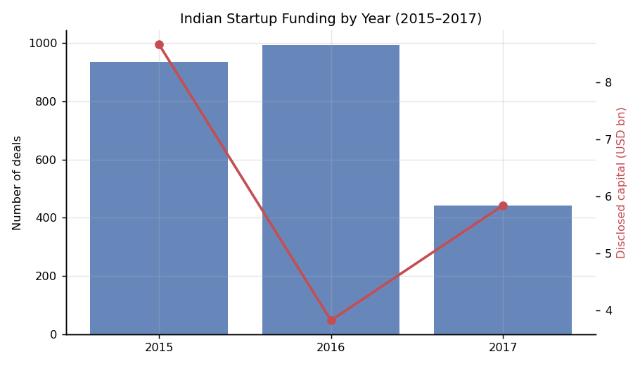
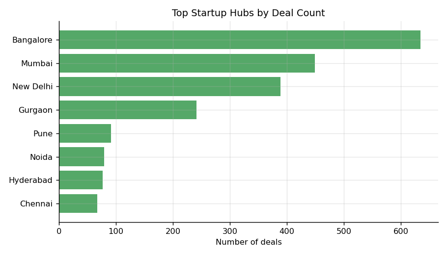
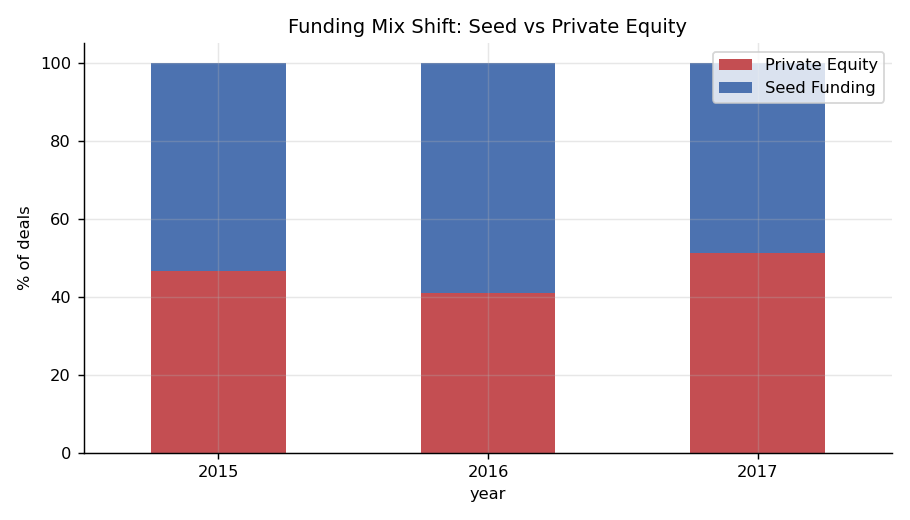
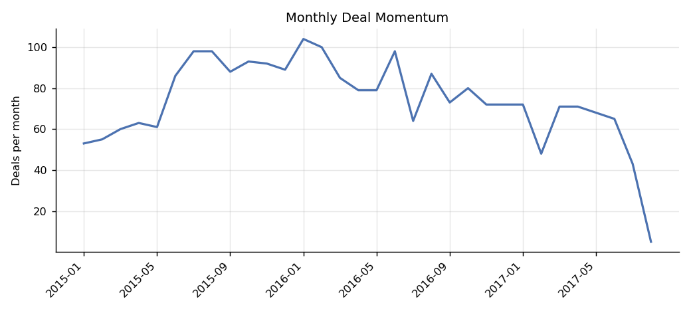

# Indian Startup Funding Analysis (2015–2017)

A SQL-first analysis of **2,372 real startup funding deals** in India, covering **$18.35B in disclosed capital** across Jan 2015 – Aug 2017. The goal: clean a messy real-world dataset, load it into a relational database, and answer business questions about where Indian venture capital flows — entirely in SQL.

## Why this project

Most analysis tutorials hand you clean data. This dataset doesn't cooperate:

- Dates in three different formats, including typos like `12/05.2015`
- Funding amounts stored as text with commas (`"1,300,000"`), 36% missing entirely
- The same investment type spelled five different ways (`Seed Funding` / `SeedFunding`)
- The same city under multiple names (`Bangalore` / `Bengaluru`, `Delhi` / `New Delhi`)

Cleaning decisions are documented in `src/clean_data.py`, and every business question is answered in `sql/analysis_queries.sql` using joins, CTEs, window functions (`LAG`, `ROW_NUMBER`), and conditional aggregation.

## Key findings

1. **2017 was a funding winter for deal count, not capital.** Deals collapsed 55% YoY (993 → 443 annualized), but disclosed capital *recovered* — because mega-rounds (Paytm $1.4B, Flipkart) masked the slowdown. Deal count and capital tell opposite stories.
2. **Capital is extremely concentrated.** The top 10 deals alone took **35% of all disclosed capital** ($6.42B of $18.35B). Averages are meaningless here — the median seed round was **$0.32M** vs **$5.0M** for private equity.
3. **The seed squeeze of 2017.** Seed deals fell from 59% of the mix in 2016 to 49% in 2017 — early-stage founders felt the winter first.
4. **NCR out-deals Bangalore at seed stage** (408 vs 325 seed deals), but **Bangalore dominates capital**: $8.42B raised vs Mumbai's $2.35B and Delhi's $2.82B.
5. **Disclosure bias warning:** 47% of seed deals have undisclosed amounts vs 22% of PE deals — any "total seed capital" metric badly undercounts reality. (Query 10 quantifies this.)

## Project structure

```
├── data/
│   ├── startup_funding_raw.csv     # original messy data (2,372 rows)
│   ├── startup_funding_clean.csv   # generated by clean_data.py
│   └── funding.db                  # SQLite DB, generated by load_to_db.py
├── sql/
│   └── analysis_queries.sql        # 12 business questions in SQL
├── src/
│   ├── clean_data.py               # cleaning pipeline with documented decisions
│   ├── load_to_db.py               # CSV -> SQLite loader
│   └── run_analysis.py             # executes SQL, prints results, saves charts
└── outputs/                        # 4 charts (trend, cities, funding mix, momentum)
```

## How to run

```bash
pip install -r requirements.txt
python src/clean_data.py
python src/load_to_db.py
python src/run_analysis.py
```

## Charts

| | |
|---|---|
|  |  |
|  |  |

## Known limitations & next steps

- Startup names are not fully standardized ("Ola" and "Ola Cabs" appear as separate entities) — entity resolution would sharpen the repeat-fundraiser analysis.
- 2017 data ends in August; annualizing changes the YoY picture slightly.
- Next step: investor-level analysis (most active VCs, co-investment networks) and a Power BI dashboard layer on top of the SQLite database.

## Data source

Public Indian startup funding dataset (originally compiled from Trak.in news coverage, widely mirrored on Kaggle/GitHub).
